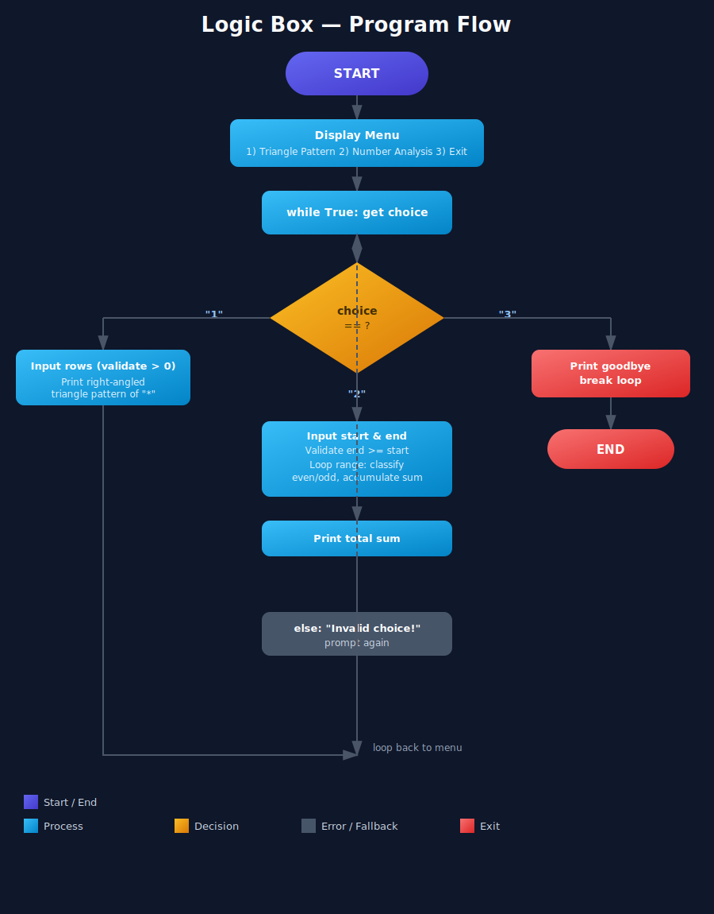

[README (1).md](https://github.com/user-attachments/files/30049368/README.1.md)
<div align="center">

# 🧩 Logic Box

### Pattern Generator & Number Analyzer

A simple, menu-driven Python console application that generates right-angled triangle patterns and analyzes ranges of numbers.


</div>

---

## 📌 Problem Statement

Beginners learning Python often need small, self-contained projects that combine **loops**, **conditionals**, and **user input validation** in a practical way. There was a need for a lightweight console tool that could:

- Generate visual patterns (like right-angled triangles) based on user-defined dimensions.
- Analyze a numeric range, classifying each number as even or odd, and computing the total sum — all while gracefully handling invalid input.

**Logic Box** solves this by providing a single, interactive menu that lets the user choose between these two utilities without needing to restart the program.

---

## 🎯 Objective

- Build an interactive, loop-driven console menu using Python.
- Implement a **pattern generator** that prints a right-angled triangle of `*` based on a user-specified number of rows.
- Implement a **number analyzer** that iterates through a user-defined range, labels each number as *even* or *odd*, and calculates the cumulative sum.
- Validate user input at every step (e.g., rejecting non-positive row counts or an end value smaller than the start value).
- Allow the user to repeat operations or exit cleanly through the same menu loop.

---

## 🛠️ Tech Stack

| Category | Technology |
|---|---|
| **Language** | Python 3 |
| **Core Concepts** | `while` loops, `for` loops, conditionals (`if`/`elif`/`else`), string formatting (f-strings) |
| **I/O** | `input()` for user interaction, `print()` for console output |
| **Execution** | Runs on any standard Python 3 interpreter (no external libraries required) |

---

## 👩‍💻 Author

**Lisa Patel**
GitHub: [@Lisapatel21](https://github.com/Lisapatel21)
Repository: [Logic-Box](https://github.com/Lisapatel21/Logic-Box)

---

## 📂 Program

**File:** [`PR.2 LOGIC BOX.py`](https://github.com/Lisapatel21/Logic-Box/blob/main/PR.2%20LOGIC%20BOX.py)

The program presents a menu with three options:

```
1. Generate Right-Angled Triangle Pattern
2. Analyze a Range of Numbers
3. Exit
```

**Option 1 — Pattern Generator**
Prompts the user for a number of rows and prints a right-angled triangle made of `*` characters, one extra star per row.

**Option 2 — Number Analyzer**
Prompts the user for a start and end number, then for every number in that (inclusive) range:
- Prints whether it is even or odd.
- Adds it to a running total, which is displayed at the end.

**Option 3 — Exit**
Prints a goodbye message and breaks out of the loop, ending the program.

Invalid menu choices, non-positive row counts, and an end value smaller than the start value are all caught and reported back to the user, who is then returned to the menu.

---

## 🔄 Program Flow



The flowchart above illustrates the full control flow of the program:

1. The program starts and displays the menu.
2. It enters an infinite loop, reading the user's choice on every iteration.
3. Based on the choice (`1`, `2`, or `3`), it branches into the pattern generator, the number analyzer, or the exit routine.
4. Any invalid entry falls through to an error message.
5. Except for `Exit`, every path loops back to the menu so the user can perform another operation.

---

## ▶️ How to Run

```bash
python "PR.2 LOGIC BOX.py"
```

Then follow the on-screen menu prompts to generate a pattern or analyze a range of numbers.

---

<div align="center">

Made with 🐍 Python — a simple project to practice loops, conditionals, and input validation.

</div>
